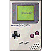

# MediaBoy



MediaBoy is a desktop app that turns photos, GIFs, videos and music into real
**Game Boy / Game Boy Color ROMs**. It wraps the [GBDK-2020](https://github.com/gbdk-2020/gbdk-2020)
toolchain for compilation and plays full-motion video on real CGB hardware with
**GBVP3**, its own video player derived from [GBVideoPlayer2](https://github.com/LIJI32/GBVideoPlayer2).


## Features

- **Image → ROM** — crop, downscale and convert a photo to a CGB ROM. HiColor
  mode squeezes ~288 colours per frame via per-scanline palette swaps. The same
  ROM also runs on an original (non-colour) Game Boy, falling back to a grayscale
  copy of the picture. Press **START** to print on a Game Boy Printer — the image
  feeds out on screen in step with the print as it happens.
- **Image gallery** — bundle several pictures into one ROM with ◀▶ switching.
  Each image carries its own grayscale copy used both for the original-GB fallback
  and for **START**-to-print on the Game Boy Printer, so any image in the gallery
  can be printed, repeatedly, on both GB and GBC.
- **GIF / Video → ROM** — convert an animated GIF or any `ffmpeg`-readable video
  into a CGB full-motion video ROM played by **GBVP3** (see below). The encoder
  is native Go, multithreaded across CPU cores, no external tools needed.
  Includes audio, fps presets (12/15/24/30/60, down-sample only), quality in
  percent, a live estimate of the ROM and cartridge size before compiling, a
  per-ROM size cap (1–8 MB) with trim / fit / split options, where fit
  holds the whole clip at the best quality the size allows.
- **Music → ROM** — sampled 3-bit PCM or chiptune playback with a cover image.

## Getting the dependencies

MediaBoy needs two external tools: the **GBDK-2020** toolchain (`lcc` + its
bundled SDCC C compiler) and **FFmpeg** (`ffmpeg`/`ffprobe`). No host C
compiler (gcc/clang) is needed to build ROMs — only to build MediaBoy itself
from source.

On startup MediaBoy checks for all of them (saved *GBDK Home*, the local
`deps/` folder, common install locations and `PATH`) and, if something is
missing, offers to install just the missing parts:

- **GBDK** is always installed locally into `deps/` next to the app (or
  `~/.config/MediaBoy/deps` when that folder is not writable). It is never
  installed system-wide.
- **ffmpeg** can be installed either **system-wide** with the OS package
  manager (apt / dnf / pacman / zypper via a password prompt, winget on
  Windows, Homebrew on macOS) or **locally** into `deps/`. An ffmpeg that is
  already on `PATH` is simply used.

The check can be reopened any time with **Dependencies** in the top-right
corner of the window, and turned off at startup from the same dialog.

## Usage

1. Pick a category in the toolbar (Image, GIF, Video, Music) and use its
   **Open…** / **Add Song…** button to load a file.
2. Adjust crop / settings; for video pick the frame rate, max ROM size and
   quality. Settings are grouped into collapsible sections — click a section
   header to fold it (the state is remembered between launches).
3. Click **Compile ROM**. The finished `.gb` / `.gbc` lands in the `out/` folder
   (build intermediates are cleaned up automatically). Use **Open output folder**
   to jump there.
4. Run the ROM in an emulator (BGB, SameBoy, Emulicious, …) or flash it to a
   cartridge.

## Building from source

Requirements: Go 1.26+, a C compiler (CGO is required by Fyne), and the
platform OpenGL/dev headers.

```bash
cd src
go build .      # produces the MediaBoy binary
go run .        # run without building
```

- **Windows**: MinGW-w64 (gcc).
- **Linux**: `sudo apt install gcc libgl1-mesa-dev xorg-dev libwayland-dev libxkbcommon-dev libgtk-3-dev`.
- **macOS**: Xcode command-line tools.

Prebuilt binaries for Windows, Linux and macOS are attached to each
[release](../../releases).

## Project layout

```
player/
  video3.asm              GBVP3 player source (rgbds)
src/
  main.go                 entry point
  internal/
    core/                 shared types, config, color helpers
    imaging/              image ops, dithering, tilemaps, conversion pipeline
    ffmpeg/               ffmpeg/ffprobe wrappers (audio decode, probing)
    deps/                 GBDK + ffmpeg auto-download
    gbdk/                 GBDK C/asset export, compiler driver, vendored libs
    music/                music player ROM export (PCM + chiptune)
    video/                GBVP3 encoder, video import; video3.gbc is the
                          built player, embedded into the binary
    ui/                   Fyne UI
```

## GBVP3: how video works

GBVP3 keeps GBVideoPlayer2's rendering trick and timing: the player races the
LCD beam and rewrites the scroll register 20 times per scanline, so every
8-pixel strip picks one of 256 colour combinations from 32 colours per frame.
What GBVP3 changes is how the picture is stored:

- **Per-line memory.** Each of the 288 lines (two interlaced fields) has its
  own slot in WRAM, so a line is coded against what it showed in the previous
  frame (GBVP2 could only code against the line above). Freed CPU time allows
  up to 9 changed strips per line instead of 3.
- **Runs.** A block of unchanged lines costs 3 bytes; the player reads their
  "no change" ops from a table in ROM, with no cost per line on screen.
- **Palettes.** Colours are fitted with k-means and rounded to what the CGB can
  show; a frame keeps the previous palette when a new one is barely better,
  which saves 64 bytes and keeps unchanged lines exact.
- **Quality.** A strip is left as it was while it is no worse than the best
  match by more than the quality's tolerance. The scale goes down to 30 %.
- **Fitting.** "Fit by lowering the quality" encodes the clip once, steering
  the quality frame by frame against a plan from a measuring pass, so the
  whole clip fills the chosen ROM size at a nearly constant quality.
- **Estimate before compiling.** The Export tab encodes in the background
  after every change and shows the ROM and cartridge size; the encode is
  deterministic, so Compile then just writes that ROM.
- **Audio.** Mono, 4 bits per sample at 9198 Hz (one sample per scanline): the
  speaker sums the left and right master volumes, giving 15 levels. The encoder
  compresses the dynamics and noise-shapes the quantisation. Half the size of
  GBVP2's audio.

On a typical clip this fits about twice as much video into the same ROM as
GBVP2 (at the default quality, ~20 s instead of ~10 s in 1 MB, ~165 s instead
of ~80 s in 8 MB).

The encoder is `src/internal/video/gbvp3enc.go` (stream format at the top) and
`gbvp3audio.go`; the player is `player/video3.asm`. The built player ROM,
`src/internal/video/video3.gbc`, is checked in, so building MediaBoy needs no
Game Boy assembler. To change the player, rebuild it with
[rgbds](https://rgbds.gbdev.io) 1.0:

```bash
cd player
rgbasm -o video3.o video3.asm
rgblink -o ../src/internal/video/video3.gbc video3.o
```

`go test ./internal/video/` checks the stream against a simulation of the
player, including its per-line cycle budget.

## Support the author

If you liked this and find it useful, you can leave me a donation:
- USDT Ton: UQD4OjiKEpHUsM2ssZMzC21X3xwkMqRUNOyj66qigxg1Eb6M
- USDT Trc20: TWJPz26hsh2h55Lm3QHdtgUBWZYLhCTXcm

## Made with Claude

MediaBoy is developed with the help of [Claude](https://claude.ai), Anthropic's
AI assistant, through Claude Code. GBVP3 — the player, the encoder, the audio
path and the tests that simulate the player — was designed and written with
Claude.

## License

MediaBoy is released under the **MIT License** (see [`LICENSE`](LICENSE)).
It derives from GBVideoPlayer2 (MIT) and uses GBDK-2020 (GPLv2 with Linking Exception)
and FFmpeg (LGPL/GPL); full third-party notices are in
[`THIRD_PARTY.md`](THIRD_PARTY.md).

## Credits

- [GBDK-2020](https://github.com/gbdk-2020/gbdk-2020) — Game Boy Development Kit.
- [GBVideoPlayer2](https://github.com/LIJI32/GBVideoPlayer2) by Lior Halphon —
  the full-motion video technique and player GBVP3 is built on.
- [rgbds](https://rgbds.gbdev.io) — the assembler for the player.
- [FFmpeg](https://ffmpeg.org) — media decoding.
- [Fyne](https://fyne.io) — the GUI toolkit.
